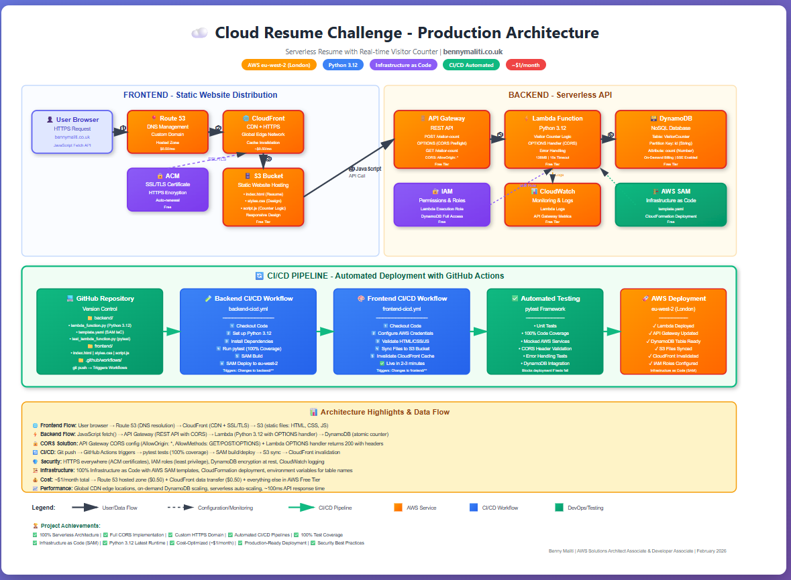

# ☁️ Cloud Resume Challenge

**🌐 Live Website:** [bennymaliti.co.uk](https://bennymaliti.co.uk)  
**📍 Region:** Europe (London) - eu-west-2  
**💰 Cost:** ~$1/month (within AWS Free Tier)

[](https://aws.amazon.com)
[](https://www.python.org)
[](https://aws.amazon.com/serverless/sam/)
[](https://github.com/features/actions)

---

## 🚀 Project Overview

Production-ready serverless resume featuring a real-time visitor counter, automated CI/CD pipeline, and custom HTTPS domain. Built as part of the Cloud Resume Challenge to demonstrate practical cloud engineering skills.

### ✨ Key Features

- ✅ **Serverless Backend:** AWS Lambda (Python 3.12) with DynamoDB for data persistence
- ✅ **RESTful API:** API Gateway with full CORS configuration for browser compatibility
- ✅ **Static Frontend:** S3 static website hosting with CloudFront CDN distribution
- ✅ **Custom Domain:** HTTPS via AWS Certificate Manager and Route 53 DNS management
- ✅ **Infrastructure as Code:** AWS SAM templates for reproducible deployments
- ✅ **CI/CD Pipeline:** GitHub Actions for automated testing and deployment
- ✅ **Comprehensive Testing:** Pytest with 100% code coverage and mocked AWS services
- ✅ **Cost Optimized:** Entire infrastructure runs for ~$1/month

---

## 🏗️ Architecture



**[📊 View Full Interactive Architecture Diagram](docs/architecture-diagram.html)**

### High-Level Architecture
```
┌─────────────────────────────────────────────────────────────────┐
│                    FRONTEND - Static Website                    │
├─────────────────────────────────────────────────────────────────┤
│                                                                 │
│  👤 User  →  📍 Route 53  →  🌐 CloudFront  →  🗄️ S3 Bucket   │
│              (DNS)           (CDN+SSL)         (HTML/CSS/JS)    │
│                                ↑                                │
│                          🔒 ACM Certificate                    │
└─────────────────────────────────────────────────────────────────┘

┌─────────────────────────────────────────────────────────────────┐
│                   BACKEND - Serverless API                      │
├─────────────────────────────────────────────────────────────────┤
│                                                                 │
│  JavaScript  →  🚪 API Gateway  →  ⚡ Lambda  →  🗃️ DynamoDB   │
│                  (REST+CORS)        (Python 3.12)  (NoSQL)      │
│                       ↓                  ↓             ↓        │
│                   🔐 IAM          📊 CloudWatch  🏗️ SAM        │
└─────────────────────────────────────────────────────────────────┘

┌─────────────────────────────────────────────────────────────────┐
│                  CI/CD - Automated Deployment                   │
├─────────────────────────────────────────────────────────────────┤
│                                                                 │
│  💻 GitHub  →  🧪 Tests  →  🚀 SAM Deploy  →  ☁️ Live Site    │
│   (Push)      (pytest)     (eu-west-2)        (2-3 mins)        │
└─────────────────────────────────────────────────────────────────┘
```

### AWS Services Used

| Service | Purpose | Cost |
|---------|---------|------|
| **Lambda** | Serverless compute for visitor counter logic | Free Tier |
| **DynamoDB** | NoSQL database for storing visitor count | Free Tier |
| **API Gateway** | RESTful API endpoint with CORS support | Free Tier |
| **S3** | Static website hosting for HTML/CSS/JS | Free Tier |
| **CloudFront** | Global CDN for low-latency content delivery | ~$0.50/mo |
| **Route 53** | DNS management for custom domain | ~$0.50/mo |
| **Certificate Manager** | SSL/TLS certificates for HTTPS | Free |
| **CloudFormation** | Infrastructure provisioning (via SAM) | Free |
| **CloudWatch** | Logging and monitoring | Free Tier |
| **IAM** | Access control and permissions | Free |

**Total Monthly Cost: ~$1.00**

---

## 📊 Technical Implementation

### Backend (Python 3.12)

**Lambda Function Features:**
- RESTful API with GET/POST methods
- OPTIONS handler for CORS preflight requests
- DynamoDB integration with error handling
- Environment-based configuration
- Structured logging to CloudWatch
- Atomic counter increments

**Database Design:**
- Single DynamoDB table with on-demand billing
- Partition key: `id` (String)
- Visitor count stored as atomic counter
- Server-side encryption enabled

### Frontend (HTML/CSS/JavaScript)

**Design Features:**
- Modern, responsive layout with CSS Grid and Flexbox
- Mobile-first design (breakpoints: 768px, 480px)
- Gradient hero section with certification badges
- Visual skills grid with hover effects
- Professional project cards
- Call-to-action buttons with animations

**JavaScript Implementation:**
- Async/await for API calls
- Error handling with retry logic (3 attempts)
- CORS-compliant fetch requests
- Dynamic DOM updates
- Loading states and error messages

### Infrastructure as Code

**SAM Template:**
- Parameterized for multi-environment support
- DynamoDB table with SSE encryption
- Lambda function with IAM policies
- API Gateway with CORS configuration
- Environment variables for table names

**GitHub Actions Workflows:**
- **Backend CI/CD:** Tests → SAM build → Deploy Lambda
- **Frontend CI/CD:** Validate → S3 sync → Invalidate CloudFront
- Separate pipelines for backend/frontend
- Automated testing before deployment

---

## 🧪 Testing Strategy

**Unit Tests:**
- 9 comprehensive test cases
- 100% code coverage
- Mocked AWS services (boto3)
- Tests for success, errors, and edge cases
- Validates CORS headers in responses

**Test Coverage:**
```bash
pytest test_lambda_function.py -v --cov=lambda_function --cov-report=term-missing
```

---

## 🚀 Deployment

### Automated Deployment (Recommended)
```bash
git add .
git commit -m "Update content"
git push origin main
```

**GitHub Actions automatically:**
1. Runs all tests (100% coverage required)
2. Builds SAM application
3. Deploys to AWS (eu-west-2)
4. Syncs frontend to S3
5. Invalidates CloudFront cache
6. ✅ Live in 2-3 minutes

---

## 💰 Cost Analysis

| Service | Monthly Cost |
|---------|--------------|
| Lambda | $0.00 (Free Tier) |
| DynamoDB | $0.00 (Free Tier) |
| API Gateway | $0.00 (Free Tier) |
| S3 | $0.00 (Free Tier) |
| CloudFront | ~$0.50 |
| Route 53 | ~$0.50 |
| **Total** | **~$1.00/month** |

---

## 🎓 Skills Demonstrated

### Cloud Engineering
- ✅ Serverless architecture design
- ✅ RESTful API with CORS configuration
- ✅ CDN optimization and cache invalidation
- ✅ DNS and SSL/TLS certificate management
- ✅ Cost optimization within Free Tier

### DevOps
- ✅ Infrastructure as Code (AWS SAM)
- ✅ CI/CD pipeline implementation
- ✅ Automated testing in deployment pipeline
- ✅ Git version control
- ✅ GitHub Actions workflows

### Development
- ✅ Python backend with boto3
- ✅ RESTful API implementation
- ✅ Frontend JavaScript with fetch API
- ✅ Unit testing with pytest
- ✅ Responsive web design

---

## 🐛 Challenges Overcome

### Challenge 1: CORS Configuration
**Problem:** API worked with `curl` but failed in browser  
**Solution:** Added OPTIONS handler in Lambda + API Gateway CORS config
```python
# Lambda OPTIONS handler
if event.get('httpMethod') == 'OPTIONS':
    return {
        'statusCode': 200,
        'headers': {
            'Access-Control-Allow-Origin': '*',
            'Access-Control-Allow-Headers': 'Content-Type',
            'Access-Control-Allow-Methods': 'OPTIONS,POST,GET'
        },
        'body': ''
    }
```

### Challenge 2: DynamoDB Table Naming
**Problem:** Lambda couldn't find DynamoDB table  
**Solution:** Used CloudFormation `!Ref` for dynamic table names
```yaml
Environment:
  Variables:
    TABLE_NAME: !Ref VisitorCounterTable  # Dynamic reference
```

### Challenge 3: CI/CD Permissions
**Problem:** GitHub Actions deployment failed  
**Solution:** Created dedicated IAM user with proper policies

---

## 📚 What I Learned

- Serverless architectures reduce operational overhead
- CORS is essential for browser-based API consumption
- Infrastructure as Code ensures reproducible deployments
- Automated testing catches issues before production
- Always test in actual deployment environment (browser vs curl)
- CloudFormation references prevent hardcoding errors

---

## 📝 Project Structure
```
cloud-resume-challenge/
├── .github/workflows/
│   ├── backend-cicd.yml
│   └── frontend-cicd.yml
├── backend/
│   ├── lambda_function.py
│   ├── template.yaml
│   ├── test_lambda_function.py
│   └── requirements.txt
├── frontend/
│   ├── index.html
│   ├── styles.css
│   └── script.js
├── docs/
│   └── architecture-diagram.html
└── README.md
```

---

## 👨‍💻 Author

**Benny Maliti**  
Cloud Engineer | AWS Certified Solutions Architect & Developer

- 🌐 **Website:** [bennymaliti.co.uk](https://bennymaliti.co.uk)
- 💼 **LinkedIn:** [linkedin.com/in/benny-maliti](https://linkedin.com/in/benny-maliti)
- 🐙 **GitHub:** [@bennymaliti](https://github.com/bennymaliti)
- 📧 **Email:** benmaliti@hotmail.com

---

## 🎯 Certifications

- ✅ **AWS Certified Solutions Architect – Associate**
- ✅ **AWS Certified Developer – Associate**
- ✅ **Microsoft Azure Fundamentals (AZ-900)**

---

## 🙏 Acknowledgments

- [The Cloud Resume Challenge](https://cloudresumechallenge.dev/) by Forrest Brazeal
- AWS documentation and best practices
- Cloud engineering community

---

**⭐ If you found this project helpful, please star the repository!**

---

*Last Updated: February 2026*